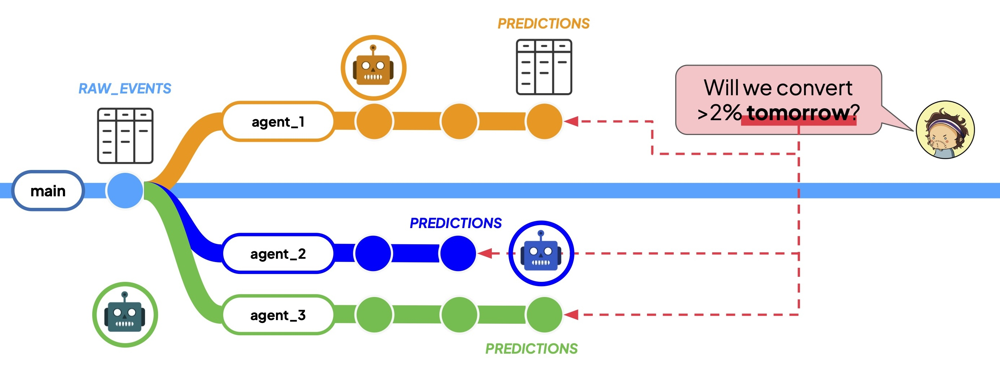
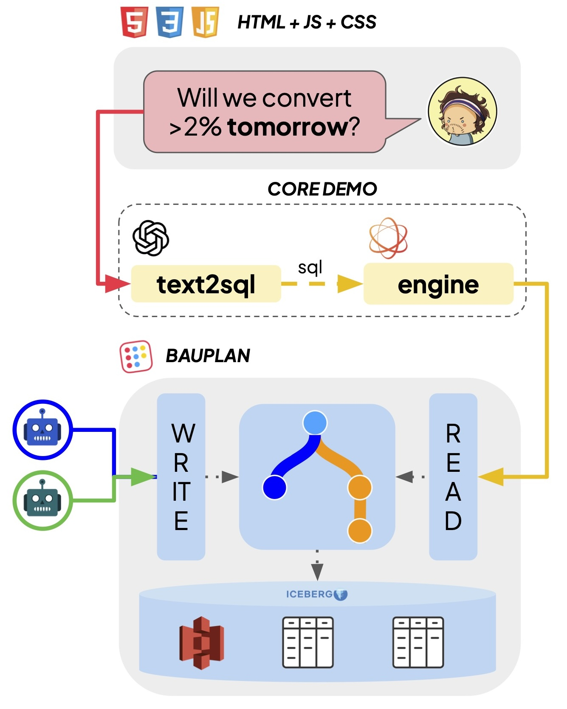

# Querying Everything Everywhere All at Once

Companion code for the demo paper *"Querying Everything Everywhere All at Once"* ([paper link forthcoming](https://github.com/BauplanLabs/querying-everything-everywhere-all-at-once)). For further background on supervaluationary semantics, the query engine internals, and formal details, consult the paper.

## The scenario

An e-commerce company has multiple AI agents producing competing purchase predictions on data branches (Git-like, copy-on-write versions of a lakehouse). Instead of picking one, we **query all branches at once** and let the system reason over disagreements using semantics from non-classical logic.



The system translates natural-language business questions into SQL, executes them across every active branch, and produces a **supervaluationary verdict**: if all branches agree, the answer is definite; if they disagree, the system surfaces a *truth glut* and shows per-branch details.

## Architecture



The system has three layers. The **web UI** (HTML/JS/CSS) lets a business user type a natural-language question. The **core demo** layer translates the question to SQL via an LLM (OpenAI) and executes it across all data branches using one of two query engines: the *ad hoc* engine (UNION ALL rewrite over per-branch DataFusion contexts) or the *native* engine (a custom Rust DataFusion `TableProvider` that exposes every branch as a single virtual table). A **supervaluation** module then compares per-branch results and reports whether branches agree or disagree. The data layer is powered by [bauplan](https://arxiv.org/pdf/2602.02335), a cloud lakehouse with Git-like branching.

## Quick start: benchmarks (no cloud account needed)

The benchmarks in the paper run entirely locally. Parquet data is auto-downloaded from a public S3 bucket on first run.

**Prerequisites:** [uv](https://docs.astral.sh/uv/getting-started/installation/) and a Rust toolchain ([rustup](https://rustup.rs/)).

```bash
# Install deps, build the Rust extension, and run all benchmarks
./bench.sh
```

NOTE: since this needs to run locally, text-to-SQL output, source files, branch names etc. are all harcoded to match the demo setup without requiring any cloud credentials.

## Quick start: demo

The live demo requires cloud accounts for the data lakehouse and the LLM.

**Additional prerequisites:**
- An AWS account with an S3 bucket linked to a [bauplan](https://www.bauplanlabs.com/) deployment
- A [bauplan](https://www.bauplanlabs.com/) user
- An [OpenAI](https://platform.openai.com/) API key (for text-to-SQL translation)

The demo requires only two environment variables:
- `OPENAI_API_KEY` — used for text-to-SQL translation
- `BAUPLAN_NAMESPACE` — the bauplan namespace where pipelines will live (defaults to `apo_multiverse`)

The remaining variables in `local.env.example` (`AWS_*`, `S3_*`, `BAUPLAN_TEST_S3_PATH`) are only needed for the full test suite and advanced development: you can ignore them for the demo.

```bash
# 1. Copy and fill in the env file
cp local.env.example .env

# 2. Start the demo (installs deps, builds Rust extension, launches pipelines + web UI)
./run_demo.sh

# The web app is served at http://localhost:8000

# 3. Stop the demo
./stop_demo.sh
```

### What the demo does

1. **Launches AI pipelines** on parallel data branches via bauplan (configurable number of variants)
2. **Starts a web UI** where you can ask natural-language business questions
3. The system translates questions to SQL, runs them across all branches, and displays:
   - Per-branch results
   - A supervaluationary summary (agreement, disagreement, truth glut)
   - Engine switching (ad hoc vs native) for side-by-side comparison

## Running tests

The test suite covers supervaluation logic, query shape classification, text-to-SQL validation, the ad hoc and native engines, server request handling, and end-to-end demo questions. Most tests run without any cloud account; a few require credentials.

```bash
# Unit tests (no cloud account needed)
uv run pytest src/tests/ -v -k "not S3 and not BusinessQuestions and not DemoQuestions" --ignore=src/tests/test_lakehouse.py

# Full suite (requires cloud credentials)
uv run pytest src/tests/ -v
```

## Repository structure

```
.
├── src/
│   ├── app/                 # Web application (FastAPI + vanilla JS)
│   │   ├── server.py        # HTTP endpoints
│   │   ├── text_to_sql.py   # LLM-powered question-to-SQL translation
│   │   ├── multiverse.py    # Branch discovery and query orchestration
│   │   ├── naive_multiverse.py   # Ad hoc engine (UNION ALL rewrite)
│   │   ├── native_multiverse.py  # Native engine (Rust MultiverseTableProvider)
│   │   ├── supervaluation.py     # Supervaluationary verdict computation
│   │   ├── query_shape.py   # Result type detection (number, boolean, list)
│   │   └── static/          # Frontend (HTML, JS, CSS)
│   ├── benchmarks/
│   │   └── bench.py         # Benchmark runner (auto-downloads data from S3)
│   ├── bpln/                # Bauplan pipeline definitions (54 variants)
│   ├── demo.py              # Pipeline launcher (creates branches, runs pipelines)
│   └── tests/
├── multiverse_provider/     # Rust PyO3 extension (DataFusion TableProvider)
│   ├── src/provider.rs      # MultiverseTableProvider + LocalMultiverseTable
│   └── Cargo.toml
├── run_demo.sh              # One-command demo launcher
├── stop_demo.sh             # Stop the demo
├── local.env.example        # Template for environment variables
└── pyproject.toml
```

## Limitations

* **Single-column query semantics** — the supervaluation layer currently handles scalar (number, boolean) and single-column set results. Generalizing to multi-column result semantics is future work.
* **Query parsing should be internalized in the native engine** — the current approach relies on the text-to-SQL LLM to modify the query for the native engine (the final query shape is the one we run in the benchmarks). Ideally, the engine itself would parse and rewrite arbitrary SQL to be branch-aware.
* TBC

## License

MIT. See [LICENSE](LICENSE).
